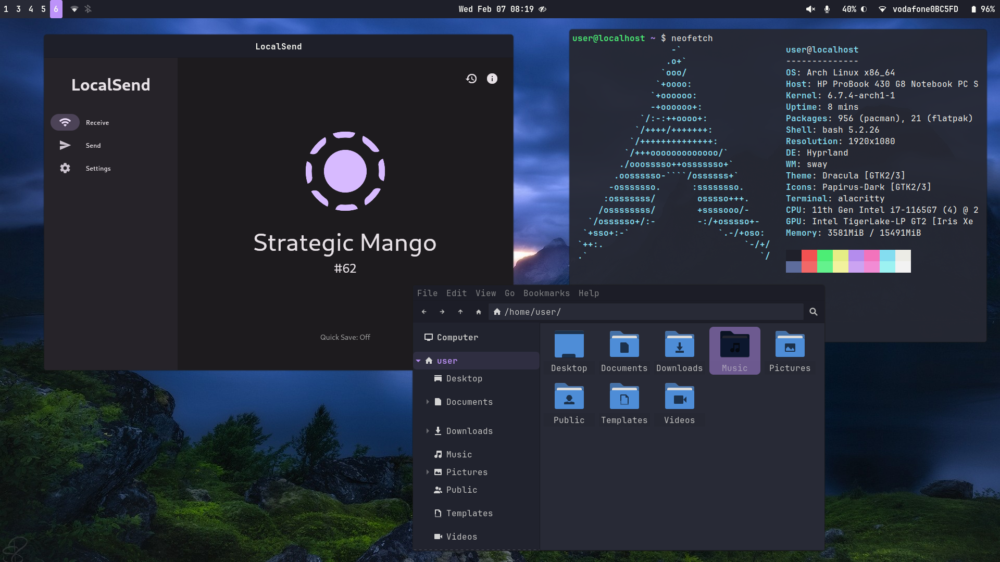

# About
Dotfiles for my hyprland+gnome setup. 



## System Info

- OS: Arch Linux
- WM: Hyprland
- Theme: [Adw-gtk3](https://github.com/lassekongo83/adw-gtk3)
- Font: Jetbrains Mono Nerd Font
- Shell: Bash
- Terminal: Alacritty
- Bar: Waybar
- App launcher: Fuzzel
- Icons: Papirus Icon Theme
- [Wallpaper](https://raw.githubusercontent.com/M0-7/dotfiles/main/Wallpapers/wallpaper.jpg)
- Browser: Firefox with [Betterfox](https://github.com/yokoffing/BetterFox)

## Installation

### Prerequisite
In order to use the commands yay needs to be setup copy and paste the one liner below to set it up.

```
mkdir -p ~/Documents/git/ && cd ~/Documents/git/ sudo pacman -S --needed git base-devel && git clone https://aur.archlinux.org/yay-bin.git && cd yay-bin && makepkg -si
```

### Arch packages

##### Hyprland+Gnome
```
yay -S gnome gnome-tweaks hplip xdg-desktop-portal-hyprland fwupd nss-mdns zram-generator neovim gnome-characters powertop intel-gpu-tools intel-media-driver ffmpeg ffmpegthumbnailer android-tools bash-completion qrencode ufw transmission-gtk git system-config-printer xdg-user-dirs-gtk xdg-user-dirs noto-fonts noto-fonts-emoji ttf-jetbrains-mono ttf-jetbrains-mono-nerd ttf-nerd-fonts-symbols ttf-nerd-fonts-symbols-common ttf-nerd-fonts-symbols-mono otf-font-awesome gnu-free-fonts hyprland papirus-icon-theme firefox alacritty pkgfile eza bat waybar dconf-editor hyprpaper mako nwg-look obsidian pavucontrol swaylock sbctl brightnessctl wl-clipboard network-manager-applet blueman fuzzel element-desktop github-cli swaylock swayidle mako polkit-gnome gnome-keyring udiskie cliphist btop xorg-xeyes vscodium-bin chromium wlogout speech-dispatcher hunspell-en_US cups bluez bluez-utils blueman neofetch xarchiver pcmanfm-gtk3 gvfs gvfs-mtp unzip zip grim slurp flatpak gedit htop imv gnome-boxes gnome-disk-utility zathura zathura-pdf-mupdf gnome-font-viewer apparmor libreoffice-still mpv gnome-calculator gnome-power-manager
```

##### Hyprland
```
yay -S hplip fwupd nss-mdns zram-generator neovim gnome-characters xdg-desktop-portal-gtk xdg-desktop-portal-hyprland xdg-desktop-portal powertop intel-gpu-tools intel-media-driver ffmpeg ffmpegthumbnailer android-tools bash-completion qrencode ufw transmission-gtk git xdg-user-dirs-gtk xdg-user-dirs noto-fonts noto-fonts-emoji ttf-jetbrains-mono ttf-jetbrains-mono-nerd ttf-nerd-fonts-symbols ttf-nerd-fonts-symbols-common ttf-nerd-fonts-symbols-mono otf-font-awesome gnu-free-fonts system-config-printer hyprland papirus-icon-theme firefox alacritty pkgfile eza bat waybar dconf-editor hyprpaper mako nwg-look obsidian pavucontrol swaylock sbctl brightnessctl wl-clipboard network-manager-applet blueman fuzzel element-desktop github-cli swaylock swayidle mako polkit-gnome gnome-keyring udiskie cliphist btop xorg-xeyes vscodium-bin chromium wlogout speech-dispatcher hunspell-en_US cups bluez bluez-utils blueman neofetch xarchiver pcmanfm-gtk3 gvfs gvfs-mtp unzip zip grim slurp flatpak gedit htop imv gnome-boxes gnome-disk-utility zathura zathura-pdf-mupdf gnome-font-viewer apparmor libreoffice-still mpv gnome-calculator gnome-power-manager
```

##### Gnome
```
yay -S gnome bluez bluez-utils gnome-tweaks hplip fwupd nss-mdns zram-generator neovim powertop intel-gpu-tools intel-media-driver ffmpeg ffmpegthumbnailer android-tools bash-completion qrencode ufw transmission-gtk git noto-fonts noto-fonts-emoji ttf-jetbrains-mono ttf-jetbrains-mono-nerd ttf-nerd-fonts-symbols ttf-nerd-fonts-symbols-common ttf-nerd-fonts-symbols-mono otf-font-awesome gnu-free-fonts firefox pkgfile eza bat obsidian sbctl element-desktop github-cli btop xorg-xeyes vscodium-bin chromium speech-dispatcher hunspell-en_US cups neofetch unzip zip flatpak htop gnome-boxes torbrowser-launcher gnome-disk-utility apparmor libreoffice-still mpv gnome-power-manager
```

##### Flatpak applications

```
flatpak install flathub com.obsproject.Studio com.github.tenderowl.frog com.github.tchx84.Flatseal org.raspberrypi.rpi-imager org.localsend.localsend_app
```

## Things to setup
1. Enable secure boot with sbctl and use TPM(PCRS:0+7)
2. Cups + Enable avahi daemon service for discovery
3. UFW (Ports 5353,22 and Transmission)
4. Theme (Adw-gtk-3 for gtk)
5. Mac Adress Randomisation
6. App Armor setup
7. Edit /boot/loader/loader.conf
8. Bluetooth setup
9. Create a Study profile and use Betterfox
10. Yay setup

## Troubleshooting

#### Flatpak apps look out of place

Flatpak applications don't follow the native system theme in order to fix this you have to do [these steps](https://itsfoss.com/flatpak-app-apply-theme/).

#### Missing fonts

If you didn't use the command above then simply use this command to get started and install all the required fonts. 

```
sudo pacman -S noto-fonts noto-fonts-emoji ttf-jetbrains-mono ttf-jetbrains-mono-nerd ttf-nerd-fonts-symbols ttf-nerd-fonts-symbols-common ttf-nerd-fonts-symbols-mono otf-font-awesome gnu-free-fonts
```
