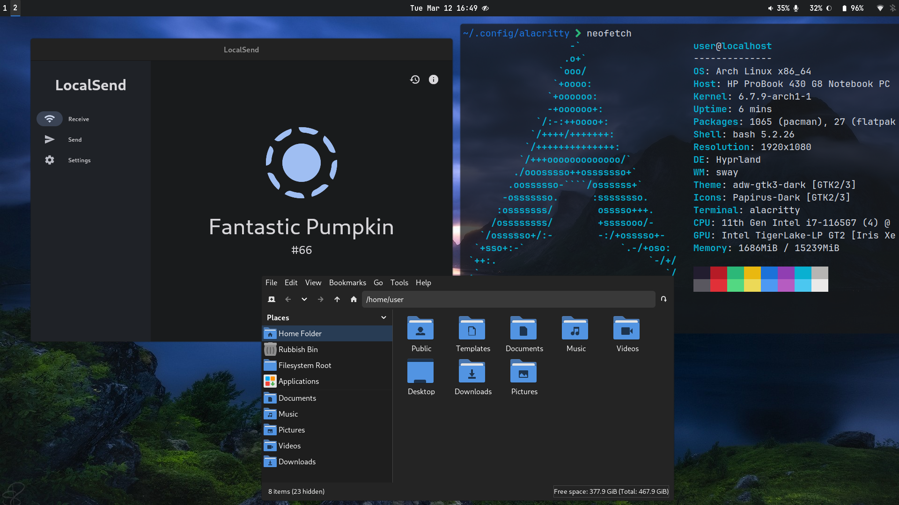

# About
Dotfiles for my hyprland + gnome setup. 



## Applications and core components of my setup I Use
- Element
- Firefox
- Transmission
- Obsidian
- VSCodium
- Mission Center
- Localsend
- Flatseal
- ProtonVPN
- Rasberry pi Imager
- MPV
- Zathura
- Rofi-wayland
- Waybar
- Dunst
- Cliphist
- Ungoogled chromium
- Gparted
- Tor browser
- imv
- Boxes
- gedit
- btop,htop
- frog
- ly

## Installation

#### Arch packages
```
yay -S hplip zram-generator wget neovim gnome-characters breeze powertop intel-gpu-tools intel-media-driver ffmpeg ffmpegthumbnailer android-tools capitaine-cursors ly bash-completion qrencode ufw qbittorrent git xdg-user-dirs-gtk xdg-user-dirs noto-fonts noto-fonts-emoji ttf-jetbrains-mono ttf-jetbrains-mono-nerd ttf-nerd-fonts-symbols ttf-nerd-fonts-symbols-common ttf-nerd-fonts-symbols-mono otf-font-awesome gnu-free-fonts hyprland papirus-icon-theme firefox alacritty pkgfile eza bat waybar dconf-editor hyprpaper mako nwg-look obsidian pcmanfm pavucontrol swaylock sbctl brightnessctl wl-clipboard network-manager-applet blueman fuzzel bitwarden element-desktop github-cli swaylock swayidle mako polkit-gnome gnome-keyring udiskie cliphist btop qt5ct qt6ct xorg-xeyes vscodium-bin brave-bin wlogout speech-dispatcher hunspell-en_US cups bluez bluez-utils blueman neofetch xarchiver gvfs zip grim slurp flatpak gedit htop imv gnome-boxes torbrowser-launcher gnome-disk-utility zathura zathura-pdf-mupdf qt5-wayland qt6-wayland handlr font-manager apparmor python-notify2 python-psutil libreoffice-still mpv android-file-transfer gnome-calculator gnome-power-manager
```

#### Flatpak apps
```
flatpak install flathub com.obsproject.Studio com.github.tenderowl.frog com.github.tchx84.Flatseal org.raspberrypi.rpi-imager org.localsend.localsend_app
```

#### Things to setup
1. Zram
2. Cups
3. UFW
4. Themes drcula for gtk, breeze for qt.
5.


#### Fonts

Fonts were always kind of confusing so these are all the necessary fonts to get started. This is also included in the command above.

```
$ sudo pacman -S noto-fonts noto-fonts-emoji ttf-jetbrains-mono ttf-jetbrains-mono-nerd ttf-nerd-fonts-symbols ttf-nerd-fonts-symbols-common ttf-nerd-fonts-symbols-mono otf-font-awesome gnu-free-fonts
```

## Troubleshooting
Because of portals crashing or some other stuff related to it apps like firefox took long time to start. In order to fix this i added this to `/usr/share/wayland-sessions/` 

```
Exec=dbus-launch --sh-syntax --exit-with-session Hyprland
```
